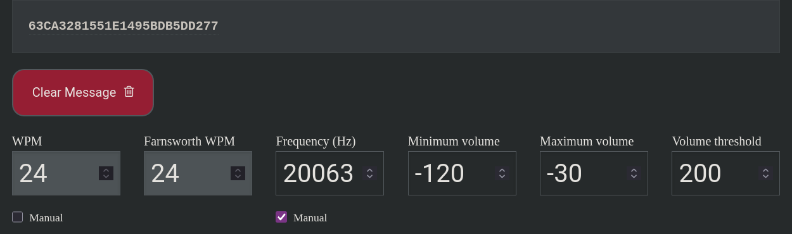

>This challenge is called Phantom Frequency, but you may also see it referred to as it's working name morse in some places.

You receive a WAV audio file containing a mysterious transmission. The signal appears to be an SSTV (Slow Scan Television) transmission. Your goal is to decode the SSTV image, which contains a QR code. Scanning the QR code will reveal the flag.

#### Directory Structure
```
./
├── base.wav
├── build.sh
├── compose.yml
├── docassets/
│   ├── morsedecode.png*
│   └── spectogram.png
├── Dockerfile
├── entry.sh
├── main.py
├── morse.md
├── padder.py
├── requirements.txt
├── webroot/
│   └── index.html
└── writeup.md
```

## Technical Implementation

### Architecture
The challenge consits of four main components:

1. **Flag  Generator** (`main.py`): Creates the flag.
2. **Signal Generator** (part of `entry.sh`): Generates an audio signal from the image.
3. **Web Server** (part of `entry.sh`): Provides the audio signal file via a download link.
4. **Containerization** (`Dockerfile` and `compose.yml`): Ensures consistent deployment.

### Component 1: Flag Signal Generator (`main.py`)

This component creates:
- The flag from the teamkey and the challenge key.
- Creates a Morse Code signal from the flag.
- Combines the generated morse Code with a pre-existing decoy morse code, on a different frequency.

#### Source Code:

`main.py`
```py
import hashlib
import os

import pycw

challengekey = "01JHQ6WHZMBCSEGDTF9Y8YFC99"
teamkey = os.getenv("TEAMKEY")

flaghash = hashlib.sha256(("%s%s" % (challengekey, teamkey)).encode()).hexdigest()
flag = "FF{%s}" % flaghash

pycw.output_wave("tones.wav", flaghash, 24, 20000)
```

#### Key Parts:

1. **Flag Generatior**
   - Concatinates a fixed challenge key `01JHQ6WHZMBCSEGDTF9Y8YFC99` with a team specific key.
   - Hashes the resulting string with SHA-256 to create a unique flag.

2. **Signal Generator**
   - Generates a morse signal at 20000 Hz and low volume, so that its not audible and automatic decoders don't pick it up immeadeately.

### Component 2: Signal Proccessing (part of `entry.sh`):

#### Source Code

`padder.py`
```py
from pydub import AudioSegment

# Load the audio files
tones = AudioSegment.from_wav("tones.wav")
base = AudioSegment.from_wav("base.wav")

# Get the duration of each audio file in milliseconds
tones_duration = len(tones)
base_duration = len(base)

# Find the longer duration
duration = max(tones_duration, base_duration)

# Pad the shorter audio file with silence
tones = tones + AudioSegment.silent(duration=duration - tones_duration)
base = base + AudioSegment.silent(duration=duration - base_duration)

# Export padded Soundfiles
tones.export("tones_pad.wav", format="wav")
base.export("base_pad.wav", format="wav")
```

`entry.sh` (Partial)
```sh
ffmpeg -i base_pad.wav -i tones_pad.wav -filter_complex "[0:a]volume=1.0[a0];[1:a]volume=0.1[a1];[a0][a1]amix=inputs=2" -ac 1 ./webroot/intercepted.wav
```

#### Key Parts:

1. **Silent Padding**
   - Add silent padding to the shorter Audio, so that both audios have the same length

2. **Processing with FFmpeg**
   - Lowers the volume of the generated audio.
   - Combines both the generated, padded audio `tones_pad.wav` and the pregenerated, padded `base_pad.wav` decoy morse code into a single audio file.

### Component 3: Web Server (part of `entry.sh`)

This component presents the challenge as a downloadable file.

#### Source Code

`entry.sh` (Partial)
```sh
cd webroot
python3 -m http.server 80
```

`webroot/index.html`
```html
<!DOCTYPE html>
<html>
    <head>
        <title>Download</title>
    </head>
    <body>
        <h1><a href="intercepted.wav">Download (intercepted.wav)</a></h1>
    </body>
</html>
```

### Component 4: Containerization

The challenge is containerized using Docker for easy deployment and isolation.

`Dockerfile`
```Dockerfile
FROM python:3.12

COPY . c
WORKDIR /c

RUN sh ./build.sh

EXPOSE 80

ENTRYPOINT [ "sh", "entry.sh" ]
```

`compose.yml`
```yml
version: '3'
services:
  python:
    build: .
    ports:
      - '80:80'
    environment:
      - TEAMKEY=TeamKey
      - CHALLENGEKEY=01JHQ6WHZMBCSEGDTF9Y8YFC99
```

`build.sh`
```sh
#!/usr/bin/sh

apt update
apt install ffmpeg -y

python3 -m pip install -r requirements.txt
```

`entry.sh`
```sh
#!/usr/bin/sh

python3 main.py
python3 padder.py

ffmpeg -i base_pad.wav -i tones_pad.wav -filter_complex "[0:a]volume=1.0[a0];[1:a]volume=0.1[a1];[a0][a1]amix=inputs=2" -ac 1 ./webroot/intercepted.wav

cd webroot/
python3 -m http.server 80
```

#### Container Design:

1. **Base Image**
   - Uses Python 3.12 as the foundation
   - Provides a minimal but complete runtime environment

2. **Environment Variables**
   - TEAMKEY: Team-specific key used in flag generation
   - Can be customized for each deployment

3. **Networking**
   - Exposes port 80 for web traffic

**HAVE FUN**

## Challenge Writeup

### Step 1: Download the challenge Files
Download the file called `intercepted.wav`

### Step 2: Examine the challenge
Examining the challenge reveales:
- The challenge consits of one audio file, containing a signal of some kind.
- The signal is a morse code transmission. It says _`SOME TRUTHS WHISPER, BARELY A BREATH ABOVE SILENCE. ONLY THOSE WHO LISTEN BEYOND THE RANGE OF HEARING WILL FIND THE KEY.`_

### Step 3: Analyze the audio file
Simple spectrum analysis is enough.
- Analyze the spectrum of the audio.


- There is another morse code transmission at 20000Hz, in addition to the one at 500Hz.

### Step 4: Decode the correct morse code transmission.
After change the settings of the decoder to fot the newly found transmission.



The result is `63CA3281551E1495BDB5DD277FFE24CD380CF94472A30BF597231B502DF4B082`. To make this be a valid flag, there needs to be:
- Only lowecase characters and numbers
- the `FF{...}` format.

Adjusting for these requirements, the flag is: `FF{63ca3281551e1495bdb5dd277ffe24cd380cf94472a30bf597231b502df4b082}`
