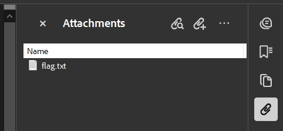

In the `Stealth Invoice` challenge, participants must analyze a seemingly normal invoice PDF to uncover hidden information. The challenge involves finding and decoding secret messages embedded within the document.

#### Directory Structure
```
Stealth_Invoice/
├── docker-compose.yml
├── flask_app
│   ├── app.py
│   ├── Dockerfile
│   ├── download
│   └── requirements.txt
├── media
│   └── image.png
├── Stealth_Invoice.md
└── writeup.md
```

## Technical Implementation

### Architecture

The challenge uses a microservice architecture built with the following components:

1.  **PDF creation** (`flask_app/app.py`): The Python script also contains the PDF creation using `canvas` as well as `PyMuPDF`.
2.  **Web Server** (`flask_app/app.py`): A Flask application that serves the download for the PDF file.
3.  **Containerization** (`flask_app/Dockerfile` and `docker-compose.yml`): Files needed in order to build the image and deploy the container.

### Component 1: PDF creation (`flask_app/app.py`)

The PDF is created using the `canvas` library and `PyMuPDF`. While the PDF contains a hidden text, there is also a text file that is embedded in the PDF. The text file contains a second flag, which is encoded using a Caesar cipher and Base64.

#### Full Source Code:
```python
import base64
import hashlib
import logging
import os

import fitz
from flask import Flask, send_from_directory
from reportlab.lib import colors
from reportlab.lib.pagesizes import letter
from reportlab.pdfgen import canvas

# Logger configuation...
# Caesar cipher function...

def create_invoice_pdf(output_filename, flag):
    c = canvas.Canvas(output_filename, pagesize=letter)
    width, height = letter

    # Invoice title
    c.setFont("Helvetica-Bold", 20)
    c.drawString(30, height - 50, "Invoice")

    # Invoice details
    c.setFont("Helvetica", 12)
    c.drawString(30, height - 100, "Invoice Number: 12345")
    c.drawString(30, height - 120, "Date: 2023-10-01")
    c.drawString(30, height - 140, "Bill To: John Doe")
    c.drawString(30, height - 160, "Address: 1234 Main St, Anytown, USA")

    # Table header
    c.setFillColor(colors.white)
    c.drawString(30, height - 200, "It's not that easy!")
    c.setFillColor(colors.black)
    c.rect(30, height - 205, 100, 15, fill=1)  # Black out the word "Description"
    c.setFillColor(colors.black)
    c.drawString(300, height - 200, "Quantity")
    c.drawString(400, height - 200, "Unit Price")
    c.drawString(500, height - 200, "Total")

    # Table content
    items = [("Widget A", 2, 50.00), ("Widget B", 1, 75.00), ("Widget C", 3, 20.00)]

    y = height - 220
    for item in items:
        description, quantity, unit_price = item
        total = quantity * unit_price
        # Black out the description
        c.setFillColor(colors.black)
        c.drawString(30, y, description)
        c.setFillColor(colors.black)
        c.drawString(300, y, str(quantity))
        c.drawString(400, y, f"${unit_price:.2f}")
        c.drawString(500, y, f"${total:.2f}")
        y -= 20

    # Total amount
    total_amount = sum(quantity * unit_price for _, quantity, unit_price in items)
    c.drawString(400, y - 20, "Total Amount:")
    c.drawString(500, y - 20, f"${total_amount:.2f}")

    # Hidden flag
    c.setFillColor(colors.white)
    c.drawString(100, 50, flag)

    c.save()
    logger.info(f"Basic PDF with first flag created successfully.")


def embed_file_in_pdf(pdf_path, textfile_path, output_pdf_path):
    # Open the existing PDF
    pdf_document = fitz.open(pdf_path)

    # Read the content of the text file
    with open(textfile_path, "rb") as file:
        file_content = file.read()

    # Embed the text file in the PDF
    pdf_document.embfile_add(textfile_path, file_content, filename=textfile_path)

    # Save the modified PDF to a new file
    pdf_document.save(output_pdf_path)
    logger.info(f"Embedded text file into PDF file successfully")


def create_pdf_full():

    challenge_flag = "#oLq3j&ZcF"
    challenge_flag_two = "M9LQXpX^Us"
    team_flag = os.getenv("TEAMKEY")

    combined_flag = challenge_flag + team_flag
    combined_flag_two = challenge_flag_two + team_flag

    hashed_flag = "FF{" + hashlib.sha256(combined_flag.encode()).hexdigest() + "}"
    logger.info(f"Flag in PDF successfully created and hashed {hashed_flag}")

    hashed_flag_two = (
        "FF{" + hashlib.sha256(combined_flag_two.encode()).hexdigest() + "}"
    )
    logger.info(f"Flag in text file successfully created and hashed {hashed_flag_two}")

    invoice_pdf = "flask_app/download/first.pdf"
    create_invoice_pdf(invoice_pdf, hashed_flag)

    # Encode the flag with Caesar Cipher (shift 5) and Base64
    caesar_encoded_flag = caesar_cipher(hashed_flag_two, 5)
    base64_encoded_flag = base64.b64encode(caesar_encoded_flag.encode()).decode()

    # Write the encoded flag to the text file
    text_file = "flask_app/download/flag.txt"
    with open(text_file, "w") as f:
        f.write(base64_encoded_flag)

    # Embed the text file with the encoded flag
    output_pdf = "flask_app/download/stealth_invoice.pdf"
    embed_file_in_pdf(invoice_pdf, text_file, output_pdf)
```

#### Key Algorithms:

1.  Flag Generation
    - Combines a fixed challenge string `#oLq3j&ZcF` and `M9LQXpX^Us` with a team-specific key
    - Applies SHA-256 hashing to create a unique flag
    - Formats it with the `FF{...}` prefix
2.  Flag Segmentation
    - First flag is written into the PDF with white font color using `canvas`.
    - Second flag is written into a text file, which is embedded into the PDF (see function `embed_file_in_pdf`)
    - The content of the text file is encoded using a Caesar cipher (shift 5) and Base64.

### Component 2: Web Server (`flask_app/app.py`)

This is the main entry point for the challenge. This flask application is used in order to serve a download site for the PDF file.

#### Full Source Code:
```python
import os
from flask import Flask, send_from_directory
app = Flask(__name__)

@app.route("/")
def download_pdf():
    return send_from_directory(
        os.path.join(app.root_path, "download"), "stealth_invoice.pdf"
    )

if __name__ == "__main__":
    create_pdf_full()
    app.run(host="0.0.0.0", port=80)
```
#### Key Features:

1.  Requirements for the flask application:
    - Flask
    - OS
2.  Main Route
    - The main route `/` serves the PDF file for download
    - The PDF is located in the `download` directory

### Component 3: Containerization

The application is containerized using Docker for easy deployment and isolation.

#### Dockerfile (`flask_app/Dockerfile`)

```dockerfile
FROM python:3

COPY . code
WORKDIR /code
RUN pip install --no-cache-dir -r flask_app/requirements.txt
EXPOSE 80

ENTRYPOINT ["python", "flask_app/app.py"]
CMD ["flask", "run", "--host=0.0.0.0", "--port=80"]
```

#### Docker Compose (`docker_compose.yml`)

```yaml
services:
  flask:
    build:
      context: .
      dockerfile: flask_app/Dockerfile

    ports:
      - '80:80'

    environment:
      - TEAMKEY=XXXXXX
```
#### Containerization Details:

1.  Base image
    - Use `Python3` as the base image
    - Copy the `code` directory into the container and set it as the working directory
    - Install the requirements and run the flask application
2.  Networking / Ports
    - Expose port 80 for the Flask application
    - Map the host port 80 to the container port 80
    - Web traffic is handled via port 80
3.  Environment Variables
    - **TEAMKEY:** Team-specific key used in flag generation
    - Can be customized for each deployment

**HAVE FUN**

## Challenge Writeup

### Step 1: Find the hidden text

- Navigate to the root (/) of the flask app. 
- The first flag cannot be found behind the black box (just a bait ;3).
- Have a look on the bottom of the file - the flag is hidden by using a white font color.

### Step 2: Download the PDF

- Download the PDF for further investigations.

### Step 3: Extract the embedded file

- Use a PDF editor that can also display embedded files, e.g. Adobe Acrobat.
- In Adobe Acrobat navigate to `Attachments` in the right toolbar.
- Open the `flag.txt`



### Step 4: Decode the flag

- The content of the `flag.txt` was encoded using caesar cipher and base64.
- In order to gather the flag we must decode it in two ways:
    - Decode Base64
    - Decode Caesar cipher (Shift: 5)
    - The flag is now shown in the already known schema `FF{...}`

### Key Insights

1.  Censoring a PDF in the wrong way can lead to data leaks (even though it was a bait in this case, think about reality).
2.  PDF files can have embedded files.

### Tools Used

* Adobe Acrobat (or any other PDF Viewer with extended features)

### Conclusion
`Stealth Invoice` was a good introduction to understand, that censoring information incorrectly may lead to possible data leaks. Furthermore, we learnt that additional files can be embedded into a PDF file.
