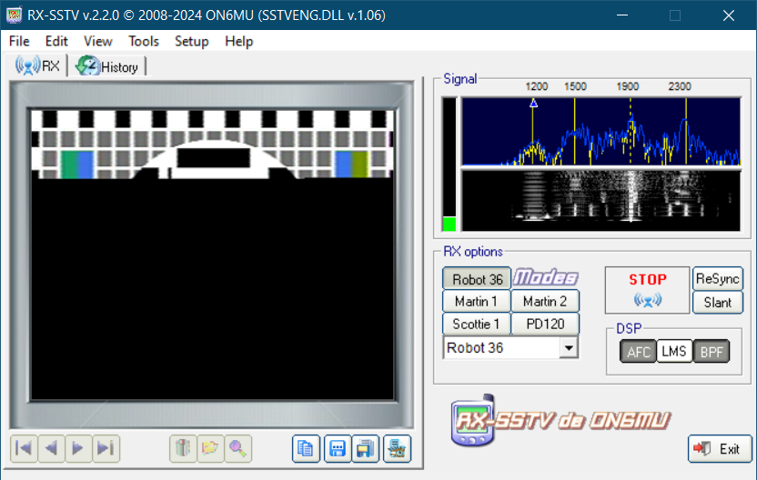
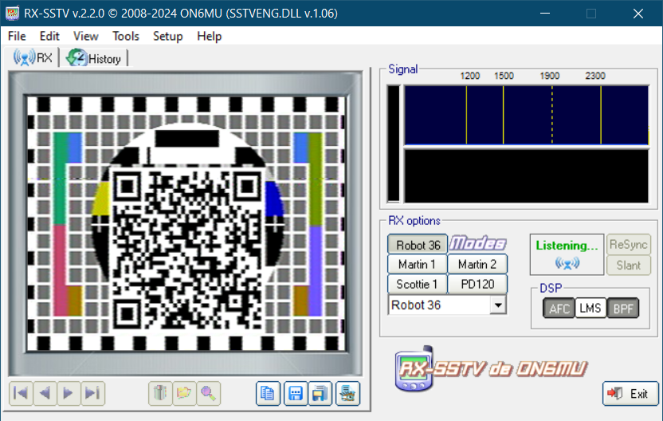

#### Directory Structure
```
./
├── bg.png
├── build.sh
├── compose.yml
├── docassets/
│   ├── audio_device.png*
│   ├── qr_scanner.png
│   ├── rx-sstv_decoding.png*
│   └── rx-sstv_done.png*
├── Dockerfile
├── entry.sh
├── main.py
├── requirements.txt
├── transmission-received.md
├── webroot/
│   └── index.html
└── writeup.md
```

## Technical Implementation

### Architecture
The challenge consits of four main components:

1. **Flag image Generator** (`main.py`): Creates the flag Image.
2. **Signal Generator** (part of `entry.sh`): Generates an audio signal from the image.
3. **Web Server** (part of `entry.sh`): Provides the audio signal file via a download link.
4. **Containerization** (`Dockerfile` and `compose.yml`): Ensures consistent deployment.

### Component 1: Flag image Generator (`main.py`)

This component creates:
- The flag from the teamkey and the challenge key.
- Creates a QR-Code from the flag.
- Superimposes the QR-Code onto a background image.

#### Source Code:

`main.py`
```py
import hashlib
import os

import PIL.Image
import qrcode

challengekey = "01JN3EADQF59H8SQ2KDC51V5HW"
teamkey = os.getenv("TEAMKEY")

flaghash = hashlib.sha256(("%s%s" % (challengekey, teamkey)).encode()).hexdigest()
print(flaghash)
flag = "FF{%s}" % flaghash

code = qrcode.QRCode(box_size=4, border=1)
code.add_data(flag)
code.make(fit=False)
im = code.make_image()
# im.show()

fgimage = im.get_image()
bgimage = PIL.Image.open("bg.png")

bgimage.paste(fgimage, (82, 67))
bgimage.save("placed.png")
```

#### Key Parts:

1. **Flag Generatior**
   - Concatinates a fixed challenge key `01JN3EADQF59H8SQ2KDC51V5HW` with a team specific key.
   - Hashes the resulting string with SHA-256 to create a unique flag.
   - Adds the `FF{...}` format used for flags.

### Component 2: Signal Generator (part of `entry.sh`):

This component generates a SSTV signal from the flag.

#### Source Code

`entry.sh` (Partial)
```sh
python3 -m pysstv --mode Robot36 placed.png ./transmission.wav
ffmpeg -i transmission.wav -filter:a "volume=0.1" ./webroot/transmission.wav
```

#### Key Parts:

1. **Signal Generator**
   - Generates a SSTV signal from the generated image.

2. **Processing with FFmpeg**
   - Lowers the volume of the generated audio.

### Component 3: Web Server (part of `entry.sh`)

This component presents the challenge as a downloadable file.

#### Source Code

`entry.sh` (Partial)
```sh
cd webroot
python3 -m http.server 80
```

`webroot/index.html`
```html
<!DOCTYPE html>
<html>
    <head>
        <title>Download</title>
    </head>
    <body>
        <h1><a href="transmission.wav">Download (transmission.wav)</a></h1>
    </body>
</html>
```


### Component 4: Containerization

The challenge is containerized using Docker for easy deployment and isolation.

`Dockerfile`
```Dockerfile
FROM python:3.12

COPY . c
WORKDIR /c

RUN sh ./build.sh

EXPOSE 80

ENTRYPOINT [ "sh", "entry.sh" ]
```

`compose.yml`
```yml
version: '3'
services:
  python:
    build: .
    ports:
      - '80:80'
    environment:
      - TEAMKEY=TeamKey
      - CHALLENGEKEY=01JN3EADQF59H8SQ2KDC51V5HW
```

`build.sh`
```sh
#!/usr/bin/sh

apt update
apt install ffmpeg -y

python3 -m pip install -r requirements.txt
```

`entry.sh`
```sh
#!/usr/bin/sh

python3 main.py
python3 -m pysstv --mode Robot36 placed.png ./transmission.wav
ffmpeg -i transmission.wav -filter:a "volume=0.1" ./webroot/transmission.wav

cd webroot/
python3 -m http.server 80
```

#### Container Design:

1. **Base Image**
   - Uses Python 3.12 as the foundation
   - Provides a minimal but complete runtime environment

2. **Environment Variables**
   - TEAMKEY: Team-specific key used in flag generation
   - Can be customized for each deployment

3. **Networking**
   - Exposes port 80 for web traffic

**HAVE FUN**

## Challenge Writeup

### Step 1: Download the challenge Files
Download the file called `transmission.wav`

### Step 2: Examine the challenge
Examining the challenge reveales:
- The challenge consits of one audio file, containing a signal of some kind.
- The signal is a SSTV transmission, so its an image usually transmitted over radio frequency.

### Step 3: Decode the SSTV transmission
This can be achieved with programs such as RX-SSTV or MMSSTV. This challenge also requires the VB-Audio Virtual Audio Cable
- Install both the Virtual audio cable and either RX-SSTV or MMSSTV.
- Make sure your audio devices are set to `CABLE Input` for the Speaker and `CABLE Output` for the microphone.
- Start RX-SSTV and then start playing the audio file; the transmission should start decoding automatically.



### Step 4: Scan the QR-Code
After the decoding has finished, scan the QR-Code to retreive the flag



`FF{5c87ba4fae730bd4c96f96576f097b4148bd35e0729c062ece28c1998d1b7bbb}`
