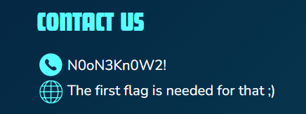
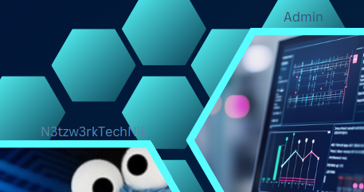

The HiddenJob challenge combines competences of physical awareness, web as well as reverse engineering. The introduction is given by a flyer that must be found before the (real) fun begins. There is also game that can be played in the course of this challenge as well.

#### Directory Structure

```
Hidden_Job/
├── docker-compose.yml
├── Hidden_Job.md
├── test_Hidden_Job.md
├── writeup.md
├── flask_app/
│   ├── app.py
│   ├── create_txt.py
│   ├── Dockerfile
│   ├── requirements.txt
│   ├── download/
│   │   ├── .gitkeep
│   │   └── ProjectDelta.zip
│   ├── hidden/
│   │   └── .gitkeep
│   └── templates/
│       └── index.html
├── media/
│   ├── image.png
│   └── image2.png
└── src/       
```

### Docker Compose
Starting off with the `docker-compose` file, this file starts the challenge container needed for the CTF.

```yml
version: '3'

volumes:
  my-django-data:

services:
  flask:
    build:
      context: .
      dockerfile: flask_app/Dockerfile

    ports:
      - '8010:5000'

    environment:
      - TEAMKEY=XXXXXXX
      - TEAM_ID=XXXXXXX
```

### Dockerfile
The Dockerfile sets up the Flask application environment.

```yml
FROM python:3

COPY flask_app/requirements.txt ./
RUN pip install --no-cache-dir -r requirements.txt

COPY . code
WORKDIR /code

ENTRYPOINT ["python", "flask_app/app.py"]
CMD ["flask", "run", "--host=0.0.0.0", "--port=5000"]
```

### Flask Application
The Flask application is defined in `flask_app/app.py`. It serves the main page and the hidden file.

```py
import os
import hashlib
import logging
import subprocess
from flask import Flask, redirect, url_for, render_template, send_from_directory, request, session

app = Flask(__name__)
app.secret_key = os.urandom(24)

logging.basicConfig(
    level=logging.INFO,
    format="%(asctime)s - %(levelname)s - %(message)s",
    datefmt="%Y-%m-%d %H:%M:%S",
)
logger = logging.getLogger(__name__)
combined_flag = ""

@app.route('/')
def index():
    client_ip = request.remote_addr
    logger.info("Index page accessed by IP: %s", client_ip)
    subprocess.run(["python", "flask_app/create_txt.py"])
    challengeflag = os.environ.get("CHALLENGEKEY")
    teamflag = os.environ.get("TEAMKEY")
    combined_flag = challengeflag + teamflag
    if combined_flag:
        hashed_flag = "FF{" + hashlib.sha256(combined_flag.encode()).hexdigest() + "}"
        logger.info(f"Flag successfully created and hashed {hashed_flag}")
    else:
        logger.error("Failed to create flag. Ensure TEAMKEY and CHALLENGEKEY are set in environment variables.")
        hashed_flag = "FLAG_NOT_DEFINED"
    return render_template("index.html", logged_in=session.get('logged_in'), hashed_flag=hashed_flag)

@app.route('/login', methods=['GET', 'POST'])
def login():
    if request.method == 'POST':
        username = request.form['username']
        password = request.form['password']
        if username == 'Admin' and password == 'N3tzw3rkTechNik':
            session['logged_in'] = True
            return redirect(url_for('index'))
        else:
            return "Invalid credentials", 401
    return render_template('index.html')

@app.route('/logout')
def logout():
    session.pop('logged_in', None)
    return redirect(url_for('index'))

@app.route('/download/ProjectDelta.exe')
def download_project_delta():
    return send_from_directory(os.path.join(app.root_path, "download"), "ProjectDelta.exe")

if __name__ == '__main__':
    app.run(host='0.0.0.0', port=5000)

@app.route('/<combined_flag>/robots.txt')
def hidden_file(combined_flag):
    return send_from_directory(os.path.join(app.root_path, "hidden"), "robots.txt")

if __name__ == '__main__':
    app.run(host='0.0.0.0', port=5000)
```

### TXT File Creation
The `create_txt.py` script generates a txt file with a dialogue and saves it to a "hidden" directory.

```py
import os
import hashlib
import logging

logging.basicConfig(
    level=logging.INFO,
    format="%(asctime)s - %(levelname)s - %(message)s",
    datefmt="%Y-%m-%d %H:%M:%S",
)
logger = logging.getLogger(__name__)

def create_robots_txt():
    challengeflag_2 = os.environ.get("CHALLENGEKEY_2")
    teamflag = os.environ.get("TEAMKEY")
    download_link = f"/download/ProjectDelta.exe"
    combined_flag_2 = challengeflag_2 + teamflag

    if combined_flag_2:
        hashed_flag_2 = "FF{" + hashlib.sha256(combined_flag_2.encode()).hexdigest() + "}"
        logger.info(f"Flag successfully created Flag: {hashed_flag_2} for robots.txt")
        
        base_hidden_folder = "hidden"
        os.makedirs(base_hidden_folder, exist_ok=True)
        
        robots_txt_path = os.path.join(base_hidden_folder, "robots.txt")
        with open(robots_txt_path, "w") as file:
            file.write(f"\nSophie: Hey Fabio, have you played Project Delta yet? The one everyone’s talking about? You can download it here : {download_link}\n")
            file.write("Fabio: Ohh, yeah! The one with the open world and those alien ruins, right?\n")
            file.write("Sophie: Yup, that’s the one! I started yesterday, and I totally messed up on the first mission. I thought it was still the tutorial and wasted all my resources.\n")
            file.write("Fabio: Hahaha, classic Sophie. But no joke, I didn’t realize how important the energy cores were until I accidentally sold two of them.\n")
            file.write("Sophie: Oof, that hurts. Have you fought that boss in the Twilight Gorge yet?\n")
            file.write("Fabio: Oh my god, yes! The one with the three phases? That guy absolutely destroyed me.\n")
            file.write("Sophie: Right?! I was so proud when I cleared the first phase, and then BAM – he pulls out those laser drones.\n")
            file.write("Fabio: Ugh, those things are so unfair. I burned through like five revival kits just to survive.\n")
            file.write("Sophie: Same. If I hadn’t gotten the jetpack upgrade, I wouldn’t have stood a chance. It saved my life.\n")
            file.write("Fabio: Jetpack upgrade?! Where did you get that?!\n")
            file.write(f"Sophie: Haha, You need to enter this {hashed_flag_2}.\n")
            file.write("Fabio: Ugh, you’re the best.\n")
            file.write("Sophie: Trust me, it’s worth it. But just wait – the next boss is ten times harder.\n")
            file.write("Fabio: Stop trying to scare me! I need a break after all this stress.\n")
        
        logger.info("robots.txt file created at %s", robots_txt_path)
    else:
        logger.error(
            "Failed to create flag. Ensure TEAMKEY and CHALLENGEKEY_2 are set in environment variables."
        )

if __name__ == "__main__":
    create_robots_txt()
```

### HTML Template
The HTML template for the main page is located in `flask_app/templates/index.html`.

## Technical Guideline

### Installation

> [!NOTE]
> Make sure to install docker and docker-compose first

**Linux**

- [Docker Linux installation](https://docs.docker.com/engine/install/ubuntu/)

- [Docker-compose Linux installation](https://docs.docker.com/compose/install/linux/)

**Windows**

- [Docker Windows installation](https://docs.docker.com/desktop/setup/install/windows-install/)

- [Docker-compose Windows installation](https://docs.docker.com/compose/install/)

After you installed docker and docker-compose you need to pull the repository via cli using this command.

```
git pull https://github.com/CTF-FlagFrenzy/challenges.git
```

Then you navigate to the root of the `Hidden_Job` challenge and type the following command in the cli.

```
docker-compose up
```

You can see all running container with `docker ps`.

**HAVE FUN**

## Challenge Writeup

### Steps to solve
1. **Find and analyse the HiddenJob flyer**:
    - The first step was to find the HiddenJob flyer which was placed on the well-known flyer board near the canteen.
    - This also leads to the first flag (static): ``FF{N0oN3Kn0W2!}``

    

2. **Credentials Hunter**:
    - On the mentioned flyer, credentials for the next steps can be found as well.

    `Username: Admin`
    `Password: N3tzw3rkTechNik`

    

3. **Login**:
    - Use the credentials from step 2 to login on the HiddenJob website.

4. **Find the second flag**:
    - After the login, open one of the recent jobs again.
    - You will gather the second flag (dynamic) through this step.

5. **Find robots.txt**:
    - Using the hints from the website, it is clear that the flag from step 4 must be reused for the robots.txt URL.
    - The URL is `<flag>/robots.txt`
    - There is also a hint for the last flag.

6. **Play ProjectDelta**:
    - The last flag may be obtained by playing ProjectDelta - download it from `/download/ProjectDelta.zip`.
    - The final boss of the game must be killed in order to get the last flag.
    - Go to the bottom right-hand edge of the map and cross the bridge there. Then continue to the right until you pass the 2nd house there should be a path leading down. This path will take you to the final boss via an invisible teleporter. Happy killing!
    - Static flag: `FF{Proj3ctD3ltA!sTh3B4st@ame!}` 


### Tools Used
- Webtools
- URL Hopping

### Conclusion
HiddenJob was a good introduction to recognising that it is worth analysing existing things more closely. In addition, basic URL hopping could be carried out and a short break could be taken for gaming.
