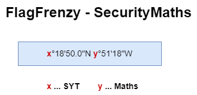
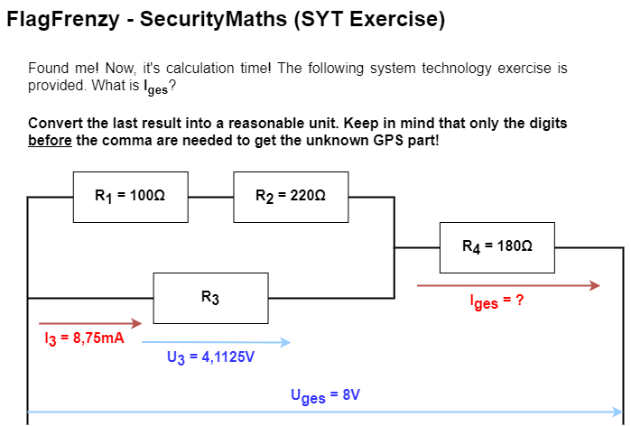
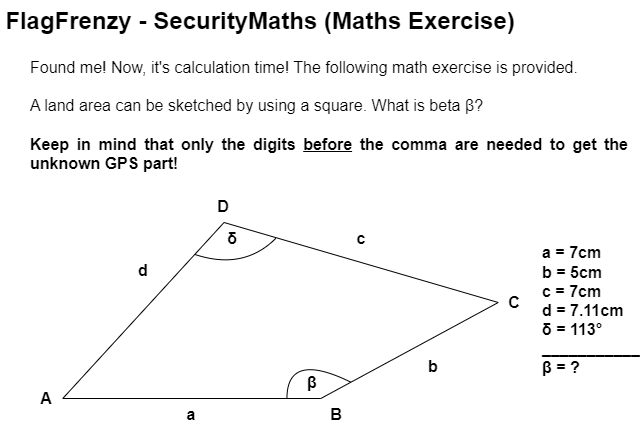
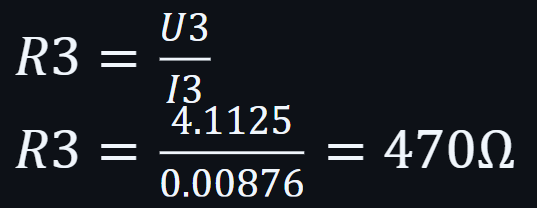
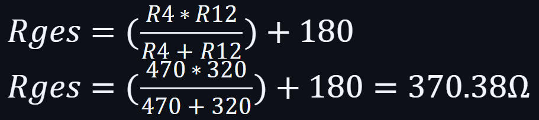
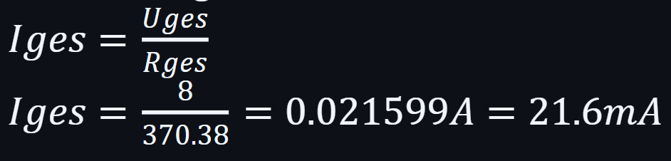
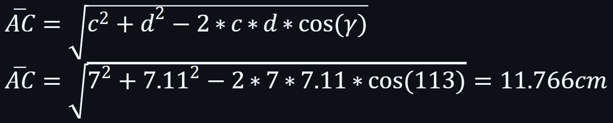
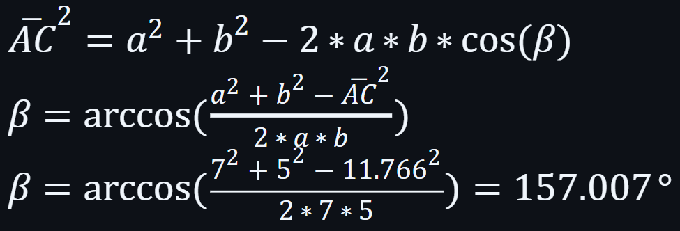

`SecurityMaths` is a challenge that combines knowledge from mathematics, systems engineering and the analysis of GPS data. The idea is that GPS coordinates are divided into three parts and have to be put together. 

#### Directory Structure

```
Security_Maths/
├── SecurityMaths_Template.pdf
├── Technical_Guide_SecurityMaths.md
└── Writeup_SecurityMaths.md
```

## Technical Implementation

### Architecture

This physical challenge has three parts:
1. **Baseline**: Baseline for the coordinates. X = SYT; Y = Maths
2. **System Technology**: A system technology problem that must be solved using the URI.
3. **Maths Problems**: A math problem that must be solved using sins/cosine rules.

The results combined with the baseline give the final coordinates. The challenge is to find the three parts and solve them. The templates in document format may be found on the official FlagFrenzy GitHub.

### Component 1: Baseline

The baseline gives information about the coordinates.

#### Illustration:



#### Details:

1.  Coordinates
    - Two coordinates are missing: x and y.
    - The x-coordinate is the result of the system technology problem.
    - The y-coordinate is the result of the math problem.

### Component 2: System Technology

Given is a circuit with three resistors and one current source. The task is to calculate the equivalent resistance and the total current.

#### Illustration:



### Component 3: Maths Problem

Given is a quadrilateral whose four sides and one angle are known. The task is to calculate β.

#### Illustration:



**HAVE FUN**

## Challenge Writeup

### Step 1: Find all pieces at their corresponding places
   - School cafeteria
   - Physics laboratory
   - Agreement with RAM (or better: find the pink panther ;3)
   - Those locations might change, depending on the CTF event.

### Step 2: Get the result of exercise one (system technology) with the help of URI (=x on the baseline)
   - Calculate R3
     

   - Calculate Rges 
     

   - Calculate Iges 
     

   
> **NOTE:** This challenge may also be solved by using a simulation tool like [Tinkercad](https://www.tinkercad.com/). Only the digits before the comma are needed to get the unknown GPS part(=21)!

### Step 3: Get the result of exercise two (math problem) with the help of sins/cosins rule (=y on the baseline)
   - Calculate distance between A & C
     

   - Calculate β
     

> **NOTE:** Only the digits before the comma are needed to get the unknown GPS part(=157)!

### Step 4: Combine the results with the GPS coordinates baseline
   - Can either be solved with [Google Maps](https://www.google.at/maps/) or [GPS-coordinates](https://www.gps-coordinates.net/).
   - Google Maps &rarr; Enter `21°18'50.0"N 157°51'18"W`
   - GPS-Coordinates &rarr; Enter the numbers in the corresponding boxes in the DMS section.
   - **Location:** Honolulu (Hawaii, USA) &rarr; `FF{Honolulu}`

### Tools Used

* Formulary (URI, Sins/Cosine rule)
* Maybe MathGPT
* Google Maps / GPS-coordinates

### Conclusion
SecurityMaths is a great opportunity to connect knowledge of various issues to end up having information that can be analysed further - in this case GPS coordinates that lead to Prof. Schmidt's favourite holiday destination.