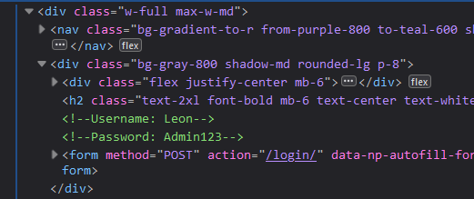
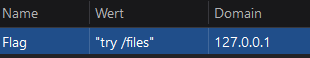
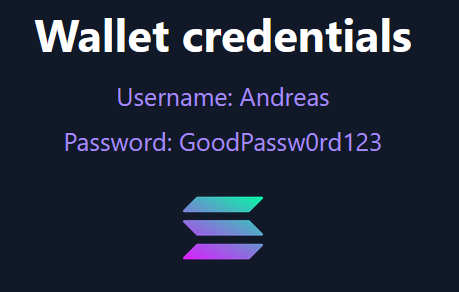
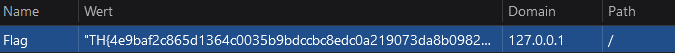

In this web challenge, you need to retrieve the flag from a cookie that dynamically contains it. The flag is stored in a 
cookie named `flag`, but it requires specific actions within the web application to access it. The challenge includes 
typical security protections like HTTP-only cookies and obfuscation that you'll need to bypass.

### Application Structure

This challenge consists of a Django web application running in a Docker container.

#### Dockerfile Configuration

```yml
version: '3'

volumes:
  my-django-data:

services:
  web:
    build:
      context: .
      dockerfile: django/Dockerfile

    volumes:
      - my-django-data:/media

    working_dir: '/code'

    ports:
      - '8000:8000'

    environment:
      - TEAMKEY=XXXXXXX
      - CHALLENGEKEY=CTF_CHALLENGE_2023
```

#### Directory Structure

```
Solana_Assets/
├── django/
│   ├── Dockerfile
│   ├── requirements.txt
│   └── app/
│       ├── manage.py
│       ├── SolanaAssets/
│       │   ├── __init__.py
│       │   ├── settings.py
│       │   ├── urls.py
│       │   └── wsgi.py
│       └── Solana/
│           ├── __init__.py
│           ├── admin.py
│           ├── apps.py
│           ├── models.py
│           ├── urls.py
│           ├── views.py
│           └── templates/
│               └── Solana/
│                   ├── index.html
│                   ├── dashboard.html
│                   ├── news.html
│                   ├── files.html
│                   └── wrong.html
├── docker-compose.yml
└── README.md
```

### Web Application Overview

The application is a simple Django web app with multiple pages:

- **Login Page** (`/`): Users can log in with specific credentials.
- **Dashboard Page** (`/dashboard`): Once logged in, users are directed to the dashboard to view crypto assets.
- **News Page** (`/news`): Contains latest cryptocurrency news.
- **Files Page** (`/files`): Contains wallet credentials.
- **Wrong Page** (`/right`): A misleading page with a troll message.

### Authentication Flow

```python
def index(request):
    # Clear any existing session
    request.session.flush()
    
    # Clear any existing cookies
    response = render(request, "Solana/index.html")
    for cookie in request.COOKIES:
        response.delete_cookie(cookie)
    
    # Set a decoy cookie
    response.set_cookie("Gemma-Lehre", "Its not that easy buddy")
    return response

def login(request):
    if request.method == "POST":
        username = request.POST.get("username")
        password = request.POST.get("password")
        
        # Check for valid credentials
        if username == "Andreas" and password == "GoodPassw0rd123":
            request.session["is_authenticated"] = True
            return redirect("dashboard")
        elif username == "Leon" and password == "Admin123":
            response = render(request, "Solana/wrong.html")
            response.set_cookie("Flag", "FF{try /files}")
            return response
        else:
            return redirect("index")
    return redirect("index")
```

### Cookie Properties

The `Flag` cookie has the following properties:
- **HTTP-only**: Prevents access to the flag via JavaScript.
- **Secure**: Ensures the cookie is only sent over HTTPS.
- **Dynamic**: The flag is unique per session and is generated during the login process.

```python
def dashboard(request):
    #! This is the flag that you need to get from the environment variables
    teamflag = os.environ.get("TEAMKEY")
    challengeflag = os.environ.get("CHALLENGEKEY")
    if not request.session.get("is_authenticated"):
        return redirect("index")
    
    else:
        combined_flag = challengeflag + teamflag
        hashed_flag = hashlib.sha256(combined_flag.encode()).hexdigest()
        logging.info(f"Hashed Flag: { hashed_flag }")
        response = render(request, "Solana/dashboard.html")
        
        for cookie in request.COOKIES:
            response.delete_cookie(cookie)
        response.set_cookie("Flag", f"FF{{{hashed_flag}}}", max_age=7 * 24 * 60 * 60)
        return response
```

### Other Routes

```python
def news(request):
    response = render(request, "Solana/news.html")
    return response

def files(request):
    response = render(request, "Solana/files.html")
    return response

def wrong(request):
    response = render(request, "Solana/wrong.html")
    response.set_cookie("Flag", "FF{try /files}")
    return response
```

### Solution Approach

The key insight to solving this challenge is to realize that:

1. **Authentication Bypass**: The dashboard page sets the actual flag cookie regardless of authentication, so direct access to `/dashboard` can bypass authentication checks.

2. **Multiple Routes**: Different routes provide hints or partial information:
   - `/files` reveals valid login credentials
   - `/right` is a misleading route that sets a fake flag

3. **Flag Generation**: The real flag is dynamically generated by combining:
   - The team-specific key (environment variable `TEAMKEY`)
   - The challenge key (environment variable `CHALLENGEKEY`)
   - Then hashing with SHA-256 and formatting as `FF{hash}`

### Step-by-Step Solution

1. Explore the various endpoints of the application
2. Navigate directly to `/dashboard` to bypass authentication
3. Inspect the cookies to find the `Flag` cookie with the dynamically generated flag
4. Submit the flag in the format `FF{hash_value}`

### Installation (For Local Testing)

> [!NOTE]
> Make sure to install docker and docker-compose first

**Linux**

- [Docker Linux installation](https://docs.docker.com/engine/install/ubuntu/)
- [Docker-compose Linux installation](https://docs.docker.com/compose/install/linux/)

**Windows**

- [Docker Windows installation](https://docs.docker.com/desktop/setup/install/windows-install/)
- [Docker-compose Windows installation](https://docs.docker.com/compose/install/)

After installing Docker and Docker Compose, clone the repository:

```bash
git clone https://github.com/CTF-FlagFrenzy/challenges.git
```

Navigate to the root of the `Solana Assets` challenge and run:

```bash
docker-compose up
```

Then access the challenge at `http://localhost:8000/`.

## Challenge Writeup

- The attacker needs to retrieve a flag from a web application. The flag is stored in a cookie named `flag`, but it is dynamically generated. The attacker must perform specific actions within the web application to gain access to the flag stored in the cookie.

- The challenge includes typical security protections, such as HTTP-only cookies and obfuscation, which the attacker must bypass.

### Steps to Solve

1. **Use Webtools to find the first credentials**:

   - The first step was to find commented credentials in the html file, use the credentials, this will redirect you to the next page.

   `Username: Leon`
   `Password: Admin123`

   

2. **Determine the cookie**:

   - Next, we needed to use the web tools again but now we have to read the content of a cookie.
     `/files`

   

3. **Get new credentials**:

   - On the `/files` you should see a new pair of credentials. Use them to enter the crypto dashboard.

   

4. **Finally get the real flag**

   - In the final stage you need to read the cookie content and enter the flag on the web application

   

### Tools Used

- Webtools

### Conclusion

This challenge was a great introduction to basic web attacks, we used simple logic to enter the dashboard and get the cookie.


