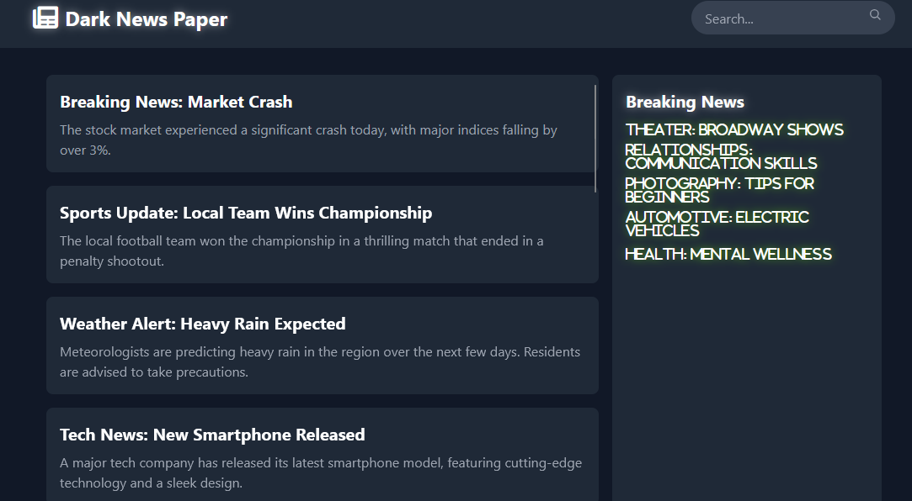

The SQL Heist challenge revolves around exploiting a vulnerable search functionality within a web application to retrieve sensitive data. 
The web app allows users to search for articles using a query, but the query is directly inserted into an SQL statement without proper sanitization, 
making it susceptible to SQL injection attacks.
The challenge focuses on understanding and exploiting SQL injection vulnerabilities to gain unauthorized access to the flag stored within the system.


### Docker Configuration

Starting off with the docker-compose file, this file starts the challenge container for the CTF. 

```yml
version: '3'

volumes:
  my-django-data:

services:
  web:
    build:
      context: .
      dockerfile: django/Dockerfile

    volumes:
      - my-django-data:/media

    working_dir: '/code'

    ports:
      - '80:80'
      
    environment:
      - TEAMKEY=XXXXXXX
```

### Web Application Frontend

The web application presents a news site with a search functionality. Articles are displayed in a grid layout, with a main section for article listings and a sidebar for breaking news. When the flag is found through exploitation, it appears as a red notification box in the bottom-right corner of the screen.

```html
    <main class="container mx-auto p-4 grid grid-cols-3 gap-4">
        <!-- Articles Section -->
        <section class="col-span-2 scrollable">
            
                <article class="bg-gray-800 p-4 rounded-lg mb-4">
                    <h2 class="text-xl font-bold mb-2">{{ article.title }}</h2>
                    <p class="text-gray-400">{{ article.content }}</p>
                </article>
            
                <p class="text-gray-400">No articles found.</p>
            
        </section>

        <!-- Breaking News Section -->
        <aside class="bg-gray-800 p-4 rounded-lg scrollable">
            <h2 class="text-xl font-bold shine mb-2">Breaking News</h2>
            <ul class="text-gray-400">
                
                    <li class="fas fa-newspape text-white shine mb-2 glow-red">{{ news.title }}</li>
                
            </ul>
        </aside>
    </main>

    <!-- Footer -->
    <footer class="bg-gray-800 p-4 text-center rounded-lg mt-4 w-full fixed bottom-0">
              <p class="text-gray-500">&copy; 2023 Dark News Paper. All rights reserved.</p>
    </footer>

    
        <div class="fixed bottom-0 right-0 m-4 p-4 bg-red-600 text-white rounded-lg">
            <p><strong>Flag: {{ flag }}</strong></p>
        </div>
    
```

### Backend Implementation & Vulnerability

The challenge contains a classic SQL injection vulnerability in the search functionality. Here's the actual implementation from the views.py file:

```python
def index(request):
    query = request.GET.get("q")  # Retrieves the search query from the GET request
    flag = None
    teamflag = os.environ.get("TEAMKEY")
    challengeflag = "NQ^D@zd$q6"
    combined_flag = challengeflag + teamflag
    hashed_flag = hashlib.sha256(combined_flag.encode()).hexdigest()
    flag_value = f"FF{{{hashed_flag}}}"

    # Creates a special article with the flag
    existing_article = Article.objects.filter(flag=flag_value).first()
    if existing_article:
        existing_article.delete()
    
    Article.objects.create(
        title="Special Article",
        content="This article contains the flag.",
        flag=flag_value,
    )

    articles = []
    if query:
        if "flag" in query.lower():
            # Blocks direct attempts to search for "flag"
            popup_script = """
            <script>
                alert('Its not that easy buddy 💀');
                window.location.href='/';
            </script>
            """
            return HttpResponse(popup_script)
            
        with connection.cursor() as cursor:
            # VULNERABLE CODE: Direct insertion of user input into SQL query
            sql_query = f"SELECT * FROM The_SQL_Heist_App_article WHERE title LIKE '%{query}%' OR content LIKE '%{query}%'"
            cursor.execute(sql_query)
            rows = cursor.fetchall()
            for row in rows:
                articles.append({"title": row[1], "content": row[2]})
                if row[3]:  # Check if flag is set
                    flag = row[3]
    else:
        articles = Article.objects.all()

    breaking_news = random.sample(list(Article.objects.all()), 5)

    return render(
        request,
        "SQL_Heist/index.html",
        {"articles": articles, "flag": flag, "breaking_news": breaking_news},
    )
```

### Understanding the Vulnerability

The vulnerability exists in the construction of the SQL query, where user input (`query`) is directly concatenated into the SQL string:

```python
sql_query = f"SELECT * FROM The_SQL_Heist_App_article WHERE title LIKE '%{query}%' OR content LIKE '%{query}%'"
```

This creates a classic SQL injection point where attackers can escape the string context and inject their own SQL commands. For example, entering a payload like `' OR '1'='1' --` would modify the query to:

```sql
SELECT * FROM The_SQL_Heist_App_article WHERE title LIKE '%' OR '1'='1' --%' OR content LIKE '%' OR '1'='1' --%'
```

The `OR '1'='1'` condition is always true, causing the query to return all articles, including the "Special Article" that contains the flag. The `--` syntax comments out the rest of the query, preventing syntax errors.

A more specific payload like `' OR flag IS NOT NULL --` would target only the article containing the flag.

### Database Model

The Article model that stores the flag looks like this:

```python
class Article(models.Model):
    title = models.CharField(max_length=200)
    content = models.TextField()
    flag = models.CharField(max_length=64, blank=True, null=True)
```

### Installation (For Local Testing)

> [!NOTE]
> Make sure to install docker and docker-compose first

**Linux**

- [Docker Linux installation](https://docs.docker.com/engine/install/ubuntu/)
- [Docker-compose Linux installation](https://docs.docker.com/compose/install/linux/)

**Windows**

- [Docker Windows installation](https://docs.docker.com/desktop/setup/install/windows-install/)
- [Docker-compose Windows installation](https://docs.docker.com/compose/install/)

After you installed docker and docker-compose you need to pull the repository via cli using this command.

```
git clone https://github.com/CTF-FlagFrenzy/challenges.git
```

Then you navigate to the root of the `The_SQL_Heist` challenge and type the following command in the cli.

```
docker-compose up
```

You can see all running container with `docker ps`.

### Exploitation

To successfully exploit the vulnerability and retrieve the flag:

1. Access the web application at http://localhost (or the deployed URL)
2. In the search box at the top of the page, enter the SQL injection payload: `' OR flag IS NOT NULL --`
3. Submit the search query
4. The flag will appear in a red box in the bottom-right corner of the screen

**HAVE FUN**

## Challenge Writeup

### Steps to Solve

1. **Explore the Web Page**

    - Begin by accessing the challenge page and examining its features to identify potential vulnerabilities. In this case, a search function is available, which may be vulnerable to injection attacks.
    - The attacker investigates the search box by inputting various entries to see how the application responds. This kind of exploration often reveals clues about potential weaknesses in how input data is processed.
    
    

2. **Exploit the Search Function**

    - After analyzing the page, the attacker attempts a **SQL injection** attack on the search function to access the flag. SQL injection involves inserting specially crafted SQL commands into input fields, exploiting the lack of proper input sanitization.
    - The attacker uses the following SQL injection payload in the search box:
      
      ```sql
      ' OR '1'='1' --
      ```
      
      - **Explanation**: This payload works by ending the initial SQL query string, injecting a true statement (`'1'='1'`), and then commenting out the rest of the query using `--`. This effectively bypasses the usual logic of the search query, causing it to return more results than intended, including the hidden flag.
    - After entering the payload, the flag is revealed as a red popup notification in the bottom-right corner of the page.

3. **Retrieve the Flag**

    - The attacker notes down the flag displayed in the popup and successfully completes the challenge.
    
    

### Tools Used

- **SQL Injection Basics**: Understanding basic SQL commands and techniques, especially SQL injection, is essential for solving this challenge.

### Conclusion

This challenge demonstrates how a simple input vulnerability in a search function can lead to unintended access to sensitive data. By exploiting SQL injection, the attacker was able to bypass the search logic and retrieve the flag, highlighting the importance of secure coding practices and input validation. Ensuring that all inputs are sanitized and using prepared statements can help prevent such vulnerabilities in real-world applications.

