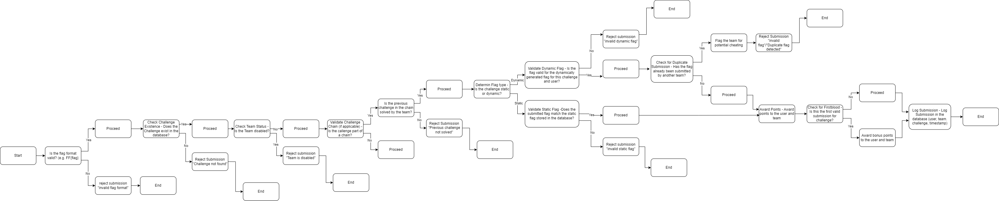

The anti-cheat system ensures the integrity of the CTF competition by validating flag submissions, detecting suspicious activity, and applying penalties when necessary. It handles both static and dynamic flags, checks for duplicate submissions, and ensures that only eligible teams and users can submit flags. The system also calculates points dynamically based on submission time and awards bonuses for firstbloods. All suspicious activities, such as duplicate flags or invalid submissions, are logged for further review by administrators.

The CTF FlagFrenzy backend provides the APIs and services that power the platform.

## Technology Stack

- Python
- Fastapi
- MySQL

## Core Services

- **Flag Submission**: Ensures submitted flags match the correct static or dynamically generated flag.
- **Duplicate Detection**: Flags teams that submit duplicate flags already used by others.
- **Chain Validation**: Ensures challenges in a chain are solved in the correct order.
- **Team and User Eligibility**: Verifies that the submitting team and user are active and authorized.
- **Point Calculation**: Dynamically calculates points based on submission time and awards firstblood bonuses.
- **Penalty System**: Applies penalties for repeated invalid submissions or suspicious behavior.
- **Logging**: Records all submissions and suspicious activities for admin review.

## Workflow

1. **Flag Submission**: Users submit flags through the frontend.  
2. **Validation**: The backend validates the flag format, checks the challenge, and ensures the team and user are eligible.  
3. **Duplicate Check**: The system checks if the flag has already been submitted by another team.  
4. **Points and Penalties**: Points are awarded for valid submissions, while penalties are applied for invalid or duplicate submissions.  
5. **Logging**: All submissions and flagged activities are logged for transparency and review.  

## Admin Panel Features (Frontend)

- **Shared Flags Overview**: Admins can see all shared flags and investigate potential cheating.  
- **Valid Flag Submissions**: Admins can review all valid flag submissions, including timestamps and team details.  
- **Challenge Monitoring**: Admins can track challenges and can deprovision the challenge.

## Flowchart

Below is the flowchart representing the anti-cheat workflow:



## Folder Tree

The anti-cheat logic is implemented in the backend, primarily in the `main.py` file. It interacts with the database to validate flags, calculate points, and log activities.
```
│   DockerFile
│   requirements.txt
└───src
    │   main.py
    │   script.py
    │
    ├───model
    │   │   database.py
    │   │   models.py
    │   │   __init__.py
```