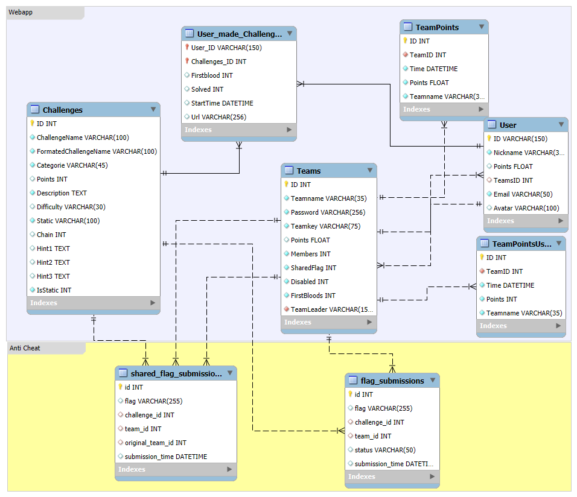

# Backend Architecture

The backend of the webapp manages and interacts with the data needed for the frontend. Data such as teams, users, challenges, and completed challenges are stored in the web app’s database. FastAPI is used to access the backend database, and this instance is configured to be accessible only by the web app itself. Users authenticate through the school’s Active Directory, ensuring secure access. The frontend is built using SvelteKit, which provides a reactive and efficient user interface framework.

## Technology Stack

- Python
- Fastapi
- MySQL

## Core Services

- **Database**: Database Design
- **Challenge Endpoints**: Handles challenge creation, updates, deletion, infos, and hints 
- **Team Endpoints**: Manages team creation, updates, deletion, member coordination, and infos
- **User Endpoints**: Manages user creation, updates, deletion, and infos
- **Endpoints for the Cluster**: Manages challenges deploying and deprovisioning


## Database
The Database saves all necessary information to run the CTF. 

In the following figure you can see the ER-Diagram of the Database. For persistence it exists a volume for the database. To import the Challenges use the challenges.json file in the DB folder.


| Table Name | Foreign Key | Description |
|------------|------------|-------------|
| Teams | TeamLeader | Stores information about teams, including their name, key (random string length(24)), total points, password and number of members, sharedFlags, firstBloods. |
| Users | TeamsID | Holds user data such as nickname, points, email, an avatar picture name, if the user is disabled and optionally links users to a team. The ID includes the name of the user and the class. |
| User_made_challenges | User_ID, Challenges_ID | Tracks user progress on challenges, recording if they've solved it and if they are the first to do so, saving the URL of the deployed container. It is the Many-to-Many table between Users and Challenges. Saves also the URL for the Container of the Challenge and the creation time. |
| Challenges | / | Contains details about challenges, including their name, a formatted name for the deployment, category, points, how often hints are used, descriptions, hints, the static flag, reference to another challenge, an attribute to determine if it’s a static challenge and difficulty. |
| TeamPoints | TeamID | Contains the team with their points over time. It is important for the graph in the GUI, especially for the admin panel. |
| TeamPointsUser | TeamID | Contains the team with their points over time. It is important for the graph in the GUI, especially for the user scoreboard. It makes an entry every 10 minutes. |

## API Endpoints
The API Endpoints are mostly for the communication to the Database. Important is to set the maximum of session high so there is no problem because if you let it on default in Fastapi you have only 20 sessions as maximum. The whole API is programed with Python. Most of these Endpoints are also implemented in Sveltekit in +server.js files.

### Teams
These Endpoints are important for the Team administration. All Endpoints are implemented in the GUI except of the teamsStrike because it was to much risk to implement it. 
| Endpoint | Method | Description | Response |
|----------|--------|-------------|----------|
| `/teams/` | GET | Retrieve a list of all teams. | `[ { "ID": 1, "Teamname": "Team Alpha", "Members": 3, "Points": 1200, "SharedFlags": 0, "Disabled": 0, "Firstbloods": 0, "TeamLeader": "Elias Pinter" }, { … } ]` |
| `/teams/{team_id}` | GET | Retrieve details of a specific team by its ID. | `{ "ID": 1, "Teamname": "Team Alpha", "Members": 3, "Points": 1200, "SharedFlags": 0, "Disabled": 0, "Firstbloods": 0, "TeamLeader": "Elias Pinter" }` |
| `/team/members/{user_id}` | GET | Retrieve TeamsID, Teamname, TeamPoints and the Nickname and ID from the members of the team from the user. | `{ "TeamsID": 1, "Teamname": "string", "Points":0, "Members": [{"ID": "string", "Nickname": "Dark Player#1048"}]}` |
| `/team/members` | GET | Retrieve TeamsID, Teamname, TeamPoints and the Nickname and ID from every Member for every Team | `[ { "TeamsID": 1, "Teamname": "string", "Points": 0, "Members": [{"ID": "string", "Nickname": "Dark Player#1048"}, {…}] }, {…} ]` |
| `/teams/{user_id}` | POST | Create a new team with the provided Teamname and a Password. Only allowed before the event starts. | `{ "ID": 3, "Teamname": "Team Gamma", "Members": 0, "Points": 0, "SharedFlags": 0, "Disabled": 0, "Firstbloods": 0, "TeamLeader": "Elias Pinter" }` |
| `/teams/{team_id}/{user_id}` | PUT | Update the Teamname and the Password of a team. Only team members can use this endpoint. Only allowed before the event starts. | `{ "ID": 1, "Teamname": "Updated Team Alpha", "Members": 3, "Points": 1200, "SharedFlags": 0, "Disabled": 0, "Firstbloods": 0, "TeamLeader": "Elias Pinter" }` |
| `/teamsStrike/{teams_id}` | PUT | Give a team a strike. If clicked twice, the team is disabled. | `{ "ID": 1, "Teamname": "Team Alpha", "Members": 3, "Points": 1200, "SharedFlags": 1, "Disabled": 0, "Firstbloods": 0, "TeamLeader": "Elias Pinter" }` |
| `/teams/{team_id}/{user_id}` | DELETE | Delete a team by its ID and set TeamsID of associated users to null. Only TeamLeader can use this endpoint. | `{ "detail": "Team deleted successfully and associated users' team ID set to null" }` |

### Users
These Endpoints are important for most other Endpoints because nearly every Endpoint need the User ID. All Endpoints are implemented in the GUI except of the DELETE Endpoint. The POST Endpoint is executed right after the authentication with Azure.
| Endpoint | Method | Description | Response |
|----------|--------|-------------|----------|
| `/users/` | GET | Retrieve a list of all users. | `[ { "ID": "PINTER Elias, 5AHITS", "Nickname": "user123", "Email": "elias.pinter@edu.htl-villach.at", "TeamsID": 1, "Points": 300, "Disabled": 0, "Avatar": "Hero.png" }, {…} ]` |
| `/users/{user_id}` | GET | Retrieve details of a specific user by ID. | `{ "ID": "PINTER Elias, 5AHITS", "Nickname": "user123", "Email": "elias.pinter@edu.htl-villach.at", "TeamsID": 1, "Points": 300, "Disabled": 0, "Avatar": "Hero.png" }` |
| `/users/` | POST | Create a new user with provided details like ID and Email. | `{ "ID": "PINTER Elias, 5AHITS", "Nickname": "user123", "Email": "elias.pinter@edu.htl-villach.at", "TeamsID": 1, "Points": 300, "Disabled": 0, "Avatar": "Hero.png" }` |
| `/users/{user_id}` | PUT | Update user details by their ID, such as Nickname and Avatar. | `{ "ID": "PINTER Elias, 5AHITS", "Nickname": "hacker1", "Email": "elias.pinter@edu.htl-villach.at", "TeamsID": 1, "Points": 300, "Disabled": 0, "Avatar": "Hacker.png" }` |
| `/users/{user_id}` | DELETE | Delete a user by their ID and remove associated user-made challenges. | `{ "detail": "User deleted successfully" }` |

### Challenges
These Endpoints are mostly important for testing. The only Endpoints which are implemented in the GUI are the first one and the third one all others are only accessable directly in the Fastapi.
| Endpoint | Method | Description | Response |
|----------|--------|-------------|----------|
| `/challenges/{teams_id}` | GET | Retrieve lists of all category challenges sorted by difficulty and solved status. | `{ "string": [{ "Hintcount": 0, "ID": 1, "Description": "string", "Categorie": "string", "ChallengeName": "string", "Points": 100, "IsStatic": 0, "Difficulty": "Easy", "Static": "staticFlag", "Chain": "1", "solved": false }, { … } ]}` |
| `/challenges/{challenge_id}` | GET | Retrieve details of a specific challenge by its ID. | `{ "ID": 1, "ChallengeName": "Challenge One", "Categorie": "Math", "IsStatic": 0, "Points": 100, "Description": "Solve a math problem", "Difficulty": "Easy", "Static": "staticFlag", "Chain": "1"}` |
| `/challenges/hints/{challenge_id}` | GET | Retrieve hints of a specific challenge by its ID. | `{ “Hint1”: “Hint”, “Hint2”: “Hint”, “Hint3”: “Hint”}` |
| `/challenges/` | POST | Create a new challenge. | `{ "ID": 1, "ChallengeName": "Example Challenge", "Categorie": "Category Name", "Points": 100, "Description": "Description of the challenge", "Difficulty": "Easy", "Chain": "1", "IsStatic": 0 }` |
| `/challenges/{challenge_id}` | PUT | Update a challenge by the ID. | `{ "ID": 1, "ChallengeName": "Updated Challenge", "Categorie": "Category Name", "Points": 100, "Description": "Description of the challenge", "Difficulty": "Easy", "Chain": "1", "IsStatic": 0 }` |
| `/challenges/{challenge_id}` | DELETE | Delete a challenge by its ID. | `{ "detail": "Challenge deleted successfully" }` |

### TeamPoints
These Endpoints are for the Scoreboard. It is configured that when you haven't a 2 in your User ID you get the Scoreboard till 14:30 otherwise only till 11:30. With the Admin Endpoint you see it without restrictions. All Endpoints are implemented in the GUI except of the POST Endpoint.
| Endpoint | Method | Description | Response |
|----------|--------|-------------|----------|
| `/teamPoints` | GET | Get a list of teams with their points at a specific time. Important for the Adminpanel. | `[ { "Points": 0, "ID": 1, "TeamID": 1, "Time": "2025-01-11T13:51:45" }, {…} ]` |
| `/teamPoints/{user_id}` | GET | Get a list of teams with their points to a specific time. Checks which class the user is in and gives only the entries before one special time. | `[ { "Points": 0, "ID": 1, "TeamID": 1, "Time": "2025-01-11T13:51:45" }, {…} ]` |
| `/teamPoints` | POST | Create a new entry in the TeamPoints table. | `{ "Points": 0, "ID": 1, "TeamID": 1, "Time": "2025-01-11T13:51:45"}` |

### User-Made Challenges
These Endpoints are very important for the Challenges because it creates an entry in the database when you start a Challenge with your User ID. It is also responsible for the firstblood and solved parameter and it also saves the start time and the URL for the cluster container. All Endpoints are implemented in the GUI except of the third one.
| Endpoint | Method | Description | Response |
|----------|--------|-------------|----------|
| `/user-made-challenges/` | GET | Retrieve all user-made challenges. | `[ { "User_ID": 1, "Challenges_ID": 1, "Firstblood": 0, "Solved": 0, "Url": "https://urlZumContainer.at" }, ... ]` |
| `/user-made-challenges/{challenge_id}/solved_by_team/{team_id}` | GET | Check if a challenge is solved by a team. | `{ "solved": true }` |
| `/user-made-challenges/{user_id}` | GET | Retrieve user-made challenges for a specific user by user ID. | `[{ "User_ID": 1, "Challenges_ID": 1, "Firstblood": 0, "Solved": 0, “Url”: “https://urlZumContainer.at”  }, …]` |
| `/user-made-challenges/` | POST | Create a new user-made challenge with user ID and challenge ID. | ` { "User_ID": 1, "Challenges_ID": 1, "Firstblood": 0, "Solved": 0, "Url": "https://urlZumContainer.at" } ` |
| `/user-made-challenges/{user_id}/{challenge_id}` | PUT | Update a user-made-challenge (solved status) by user and challenge IDs. If it is firstblood the user and the team earns 40% of the challenge points. | ` { "User_ID": 1, "Challenges_ID": 1, "Firstblood": 1, "Solved": 1, "Url": "https://urlZumContainer.at" } ` |
| `/user-made-challenges/{user_id}/{challenge_id}` | DELETE | Deletes the specific user-made-challenge Entry | `{ "detail": "User-made challenge deleted successfully" } ` |

### Cluster Communication

These Endpoints are very important to communicate with the cluster. It sends the deploy and the deprovision request to the cluster. All Endpoints are implemented in the GUI.
| Endpoint | Method | Description | Response |
|----------|--------|-------------|----------|
| `/deploy/{user_id}/{challenge_id}` | GET | Retrieve the Kubernetes output and create a pod in the cluster. | `Stdout: "Url//https://containerUrl.at"` |
| `/deprovision/{user_id}/{challenge_id}` | POST | Deprovision a specific pod and delete the entry in the user-made-challenge table. | `{ "detail": "Deprovisioning successful" }` |

## Folder Tree
Here you can see the folder tree of the API. The database connection is established in the database.py file and the creation of the tables is defined in the model.py. The whole Fastapi is in the main.py.
```tree
│   DockerFile
│   requirements.txt
└───src
    │   main.py
    │   script.py
    │
    ├───model
    │   │   database.py
    │   │   models.py
    │   │   __init__.py
```