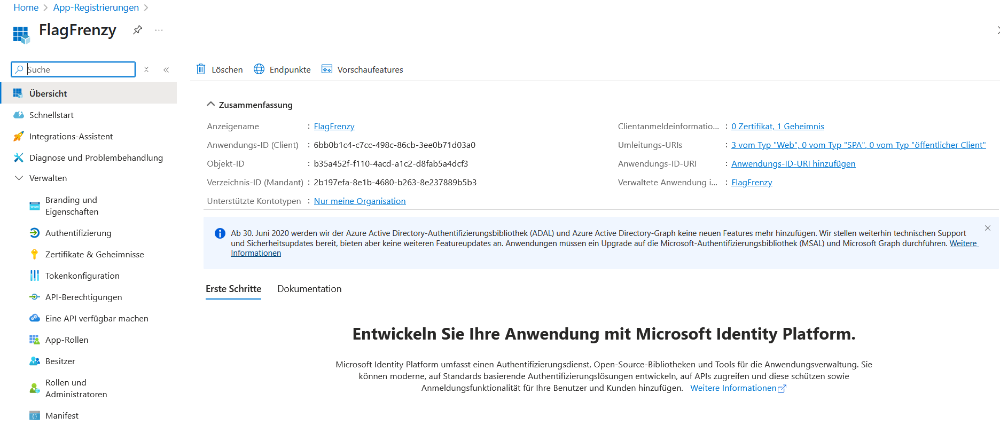
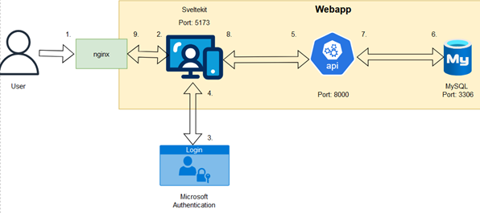
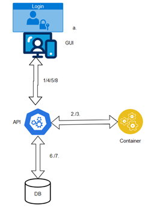
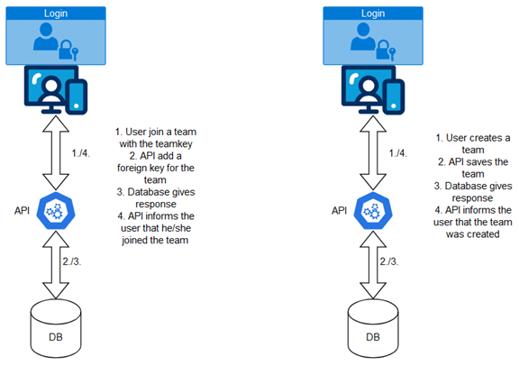
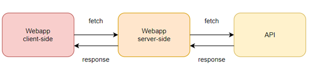

# Webapp Overview

The CTF FlagFrenzy web application is the primary interface for users interacting with the platform. It provides an intuitive interface for both competitors and administrators.

## Core Features

- User registration and authentication
- Challenge discovery and submission
- Real-time scoreboard
- Team management
- Administrative controls and monitoring

## Authentication 
The Authentication is made with Azure. For this purpose, a separate app was created in Azure and Svelte contacts this and registers the user with Azure. Important is the .env file in the flagfrenzy-sveltekit folder. This file includes all Azure variables.


The whole Authentication works with following files:
- flagfrenzy-sveltekit/src/hooks.server.ts
- flagfrenzy-sveltekit/src/routes/callback/server.ts
- flagfrenzy-sveltekit/lib/auth/config.ts
- flagfrenzy-sveltekit/lib/auth/services.ts

The most important file is the services.ts because there the Azure communication begins. The Hooks Server is used before every page and checks the authentication. The callback is the file which is linked in Azure.

## Concepts
These Concepts explain how the Webapp works.

### Backend & Frontend


For a better understanding of the concept, the figure shown above includes following steps:
- 1. -> user accesses the nginx proxy on port 4443
- 2. -> nginx redirect to the sveltekit application on port 5173 (Productive 3000)
- 3. -> sveltekit redirects to the Microsoft authentication
- 4. -> Microsoft authentication gives the user informations sveltekit
- 5. -> sveltekit make a request to an API endpoint
- 6. -> API make a request to the database for the requested information
- 7. -> database responses with the data from the requested table
- 8. -> API responses with the data from the requested endpoint and sveltekit the information
- 9. -> nginx forwards the sveltekit pages to the user via https

### Workflow Challenge start


For a better understanding of the concept, the figure shown above includes following steps:
- a. ->  User is authenticated
- 1. ->  User start a Challenge
- 2. ->  Deploy call
- 3. ->  Response from the container cluster
- 4. ->  Response from the API
- 5. ->  User Solve the Challenge
- 6. ->  API Updates the score and save who the challenge solved
- 7. ->  API gets the data
- 8. ->  Web gets the data

### Teams Workflow


This Figure describes the workflow of teams. On the right side it describes how the User creates the team and how it comes in the database. On the left side it describes how a user can join a team. To join a team, it is necessary to have the Teamkey from this team because with that it is possible to create the foreign key for the team. Each team has a maximum of four members.

### API Concept

This figure describes the concept of the API communication for the Webapp. The client-side requests the API from the server-side, and this makes the real request to the backend API. The response is then sent back to the webpage via the server-side API from svelte. This is necessary because otherwise the container cannot reach each other. 

## How to run
The whole webapp can be deployed with one Dockercompose this needs two .env files one in the flagfrenzy-sveltekit and one in the root. The one in the root is important for the database and the API. 
```bash
git clone https://github.com/CTF-FlagFrenzy/webapp.git
cd webapp
sudo setcap cap_net_bind_service=ep $(which rootlesskit)  ## Rootless Docker
systemctl --user restart docker ## Rootless Docker
docker compose up 
```

To run the webapp in productive mode in another environment you must run following commands:
```bash
cd flagfrenzy-sveltekit
npm install
npm run build
```

If you want to use the Hot Reload feature you need to change the Dockerfile in flagfrenzy-sveltekit:
```dockerfile
FROM node:lts-alpine
WORKDIR /app
COPY package*.json ./
RUN npm install

RUN npm install chart.js
RUN npm install -D tailwindcss postcss autoprefixer
RUN npm install @fortawesome/free-solid-svg-icons @fortawesome/free-regular-svg-icons @fortawesome/svelte-fontawesome
RUN npx tailwindcss init -p
COPY . .
EXPOSE 80

CMD ["npm", "run", "dev", "--", "--host", "0.0.0.0"]
``` 
